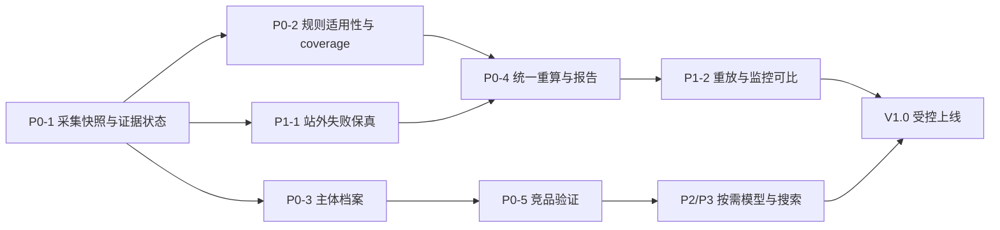

# GEO 产品与工程审计：证据优先、免费可用、按需升级

日期：2026-09-12  
审计基线：本地仓库 `c9cf40c6d39f494ec6aa15c82c9d67a32f5e6c43`（审计前工作区干净）。  
目标仓库：https://github.com/lucas-project/GEO  
交付范围：只新增本报告；不修改业务代码、配置、数据库或依赖。

## 1. 产品结论与审计边界

**无需重写。需要先修正“产品声称测量的东西”和“代码实际测量的东西”之间的差距。** 当前站内规则可以提供有用的内容检查，但不足以测出网站权威性、真实 AI 引用概率、全网讨论量或商业转化能力。增加付费模型并不能自动修复这些定义问题。

建议首发定位为：**基于可访问网页证据的内容可提取性与技术检查工具**。完整闭环是：选择页面 → 确认网站主体 → 获取页面 → 展示证据及适用检查 → 生成可审阅修改草稿 → 同范围复查。竞品先支持用户确认的 URL；站外讨论先提供证据收集和有限发现；真实搜索引用观测独立于站内得分。

本次进行了全仓文件清单检查，深读评分、抽取、抓取、竞品、模拟、站外发现、AI 基础设施及其关联调用路径，并检查 API、UI 报告、持久化、队列、监控、优化、内容生成、intelligence 和部署文档。阅读了 `AGENTS.md`、`geo_score_ref.md`、产品蓝图、README、package 与 Prisma schema。客户端目录也纳入清单检查，但 CLI、扩展和 WordPress 插件不构成本次逐项端到端验收。

本地没有 `.codegraph/`，本会话未暴露 CodeGraph 工具，已按指引提出初始化选项；本次基于只读源码检查继续，没有建立索引。未读取 `.env` 密钥内容，未运行生产数据库迁移、真实付费分析或线上负载测试。以下“已证实”指代码路径或本地检查已证实，不代表已复现某个具体大站的线上分数。尚无带人工标注的评测集，因此本文不编造免费/付费方案的实际准确率。

### 1.1 优先结论

| 优先级 | 结论 | 用户影响 |
|---|---|---|
| P0 | 缺失数据、无法访问、未配置能力与真实负面混在数值里 | 抓不到会被理解成网站差 |
| P0 | 站外低分通过层级传播压低总分，引用概率没有统计依据 | 权威站点也可能被称为 GEO 盲区 |
| P0 | LLM 实体抽取失败返回空数组，空数组进一步扣分 | 模型故障变成网站质量下降 |
| P0 | 竞品没有可靠验证/排名，存在错误静态种子 | 产生不相关竞品与无意义差距 |
| P0 | 深度扫描、扩展扫描更新不一致 | 同一报告中总分、雷达图、建议不一致 |
| P0 | mock/local/persona/live 数据未充分隔离 | 模拟输出进入“真实引用”含义的指标 |
| P1 | 反爬失败被折叠成空结果，超时不取消底层工作 | 长时间运行仍得出零证据 |
| P1 | 当前 TypeScript 检查失败；队列缺少原子领取 | 上线可靠性与重复成本风险 |
| P2 | 首次审计同步做实体、向量、问题和竞品生成 | 无用户时也引入不必要外部依赖 |
| P3 | 产品范围大于免费可证明能力 | 需要收敛导航、解释与升级承诺 |

### 1.2 本地检查结果

| 检查 | 结果 | 解释 |
|---|---|---|
| `npm.cmd test -- --reporter=dot` | 87 个测试文件、268 个测试全部通过 | 主要验证规则和 mock/fixture 行为，不能证明真实 GEO 准确率 |
| `npx.cmd tsc --noEmit --incremental false` | 失败 | 下列已有类型错误；没有写入增量编译缓存 |
| `npm.cmd run lint` | 完成，有大量警告 | 深层模块导入、未使用变量、Hook 依赖等；`next lint` 提示弃用 |
| build | 未执行 | 已有类型检查失败；本次没有把构建/生产可运行性宣称为通过 |
| 真实网站重复测试 / 真实模型效果测试 | 未执行 | 需要固定样本、预算与可访问性记录；见第 11 节 |

PowerShell 的 `npm.ps1`/`npx.ps1` 因系统执行策略不可运行，改用现有 `.cmd` 入口；未更改系统执行策略。

已发现类型错误位置：

- `src/components/geo/visibility-check-results.tsx:266`，以及 368–370 行：fallback 对象缺少 `excerpts`，回调/索引类型不完整。
- `src/modules/geo-audit/parse-scoring-meta.ts:42`：可选 simulation history 项类型不一致。
- `src/modules/geo-audit/scoring.test.ts:184`：缺少 `PresenceSignals` 类型导入。
- `src/modules/geo-audit/suggestion-generators.ts:258`：`Object.fromEntries` 到完整维度 Record 的断言不成立。
- `src/modules/off-site-presence/platform-registry.ts:77`：`string[]` 与平台枚举数组不兼容。
- `src/modules/off-site-presence/platforms/quora.test.ts:13`、`:23`：fixture 缺少品牌字段。
- `src/modules/off-site-presence/search-market-hint.test.ts:5`：fixture 缺少 `source`。

## 2. A：当前 GEO 分数究竟怎样计算

### 2.1 主调用链与输入范围

`src/app/api/geo-audit/route.ts` → queue `geo-audit.run` → `src/modules/geo-audit/handlers.ts` → `service.ts::runAudit`：

1. 创建 Site、GeoAudit。
2. 抓首页、robots、sitemap、发现页面；常规审计默认上限 `min(CRAWL_MAX_PAGES, 5)`，不是全站。用户选页和 `maxPages` 可改变样本。
3. 只抽取有 `renderedHtml` 的页面。首页不可用通常导致审计失败；次页失败会被排除出评分样本。
4. `extraction/service.ts` 抽 HTML 信号，并逐页用 LLM 抽实体。
5. 汇总 checklist 与站内外链 footprint；可选 Serper 轻量探测；同步索引首页 chunks、读取 citation snapshot 与校准配置。
6. `scoring.ts::scoreAll` 算 12 维分数 → checklist 调整 → schema stack 调整 → hierarchical 总分 → 1000 分参考映射。
7. 派生 issues/fixes，再生成 LLM narrative、模拟问题和竞品建议，保存报告。

**主总分是 0–100，modelVersion 为 `hierarchical-v2`。`geo_score_ref.md` 的逐项 1000 分并未被逐项照搬。**

### 2.2 12 个原始维度的准确规则

源文件：[scoring.ts](../src/modules/geo-audit/scoring.ts)。下面所有维度最后均 `round` 并限制到 0–100；条件不满足且未列减分时，就是不加分。后续还会应用 2.3 的额外修正。

| 维度 | 初始值与加减规则 |
|---|---|
| `aiReadability` | 起点 50；正文 chunk 词数 >400：+15，<120：−25；平均句长 >0 且 <28：+12，≥35：−12；有 HTML lang：+6，否则 −6；hydration 增加文本 >500 字符：−14 |
| `citationFriendliness` | 起点 45；有 FAQ：+18，否则 −8；FAQPage：+14；有 table：+10；有作者：+8，否则 −10；含数字的 chunks >2：+6 |
| `semanticClarity` | 起点 50；H1 恰好 1：+14，0：−15，多个：−8；H2 ≥2：+12，0：−12；H3 ≥1：+6；title 长度 >15：+8，否则 −6 |
| `entityClarity` | 起点 45；实体 ≥8：+18，<3：−18；relevance≥0.7 的实体 ≥3：+12；至少一个 organization/product：+8；Organization 或 Product JSON-LD：+10，否则 −5 |
| `answerExtraction` | 无 chunks：0；否则起点 40；answer-first 比例 >0.4：+22，<0.15：−15；FAQ≥3：+14；带 heading 的 chunk 比例 >0.6：+10 |
| `chunkOptimization` | 无 chunks：0；否则起点 50；平均词数严格 >60 且 <250：+18，≤60：−10，其余：−14（恰好 250 也减分）；含列表 chunks≥2：+10；chunks≥6：+8 |
| `summarizationQuality` | 起点 50；meta description 长度 >70：+16，否则 −12；有 OG description：+6；首 chunk >40 词且 answer-first：+14；否则若首 chunk <30 词：−10；FAQ≥2：+8 |
| `trustSignals` | 起点 45；有作者：+18，否则 −14；Organization：+10；Article/NewsArticle：+10；外链 >2：+6，0：−6；正则数字密度每 200 词 ≥1：+10，否则 −8；有“近期日期”信号：+8，否则 −6 |
| `structuredContent` | 无 JSON-LD types：直接 20；否则起点 35 + min(40, 类型数×8)；FAQPage +8、Product +8、Article/NewsArticle +6、BreadcrumbList +4 |
| `crawlerFriendliness` | 起点 60；robots 抓到且 allowed：+12，抓到但禁止：−35；robots 声明 sitemap：+12；robots 未抓到：−8；首页 hydration 增加文本 >800：−20 |
| `offSitePresence` | 站内 footprint 未提供时固定 40；提供时按平台链接、sameAs、社交、社区、reviews、可选 Serper 加分并设置保底，详见下一表 |
| `commercialReadiness` | footprint 未提供时固定 45；否则起点 30；pricing 页面或 Product offers：+25，否则 −10；首页 CTA：+25，否则 −12；信任区：+25，否则 −8；compare 页面或任意抽取页面有 table：+15 |

多页时，对除 crawler、off-site、commercial 之外的 9 维逐页打分，以根页面 2、其他页面 1 做加权均值，再 round。根页判断使用 URL 字符串相等。`trustSignals` 虽在这 9 维里，却通过 `allExtractions(ctx)` 使用整个审计的 extractions，导致每页都算同一站点汇总信任分，不是真正逐页作者/信任评估。

`trustSignals` 的“近期”实现并不严格：Article/NewsArticle/WebPage 的日期解析后 `days <=90` 即通过，未来日期也通过；另一条分支只检测文本中 updated/published/modified 加年份/月名，不实际校验 90 天。

`offSitePresence` 的完整规则：

| 条件 | 分数 |
|---|---|
| 有 linked platforms，数量 L | +min(50, 10+10L) |
| 链接 Reddit/Quora | +12；否则 probe Reddit estimate>0 也 +12；两者均无且非 strong footprint 时 −4 |
| 链接 G2/Capterra/Trustpilot | +12；否则搜索发现 reviews +10；再否则非 strong 时 −3 |
| sameAs ≥2 / =1 | +14 / +8；=0 且非 strong 时 −3 |
| 社交平台数 S≥3 / =2 / =1 | +10 / +6 / +3；社交范围为 LinkedIn、X、YouTube、Facebook、Instagram、GitHub |
| probe.source=serper 且 verified 非空 | +min(18, 6+3×verified 数) |
| Serper mediaMentions>0 | +min(12, 4×mediaMentions) |
| Serper primarySourceDomains≥2 | +8 |
| 最终保底（按顺序首次命中） | L≥4 或 L≥3且S≥2：58；L≥2：45；L≥1：32；probe verified≥2：38；sameAs≥1：28；其余：18 |

strong footprint 定义为 L≥3 或 S≥3。由此可见，“没有获取站外讨论”并不是完全等于 0；代码已经加了人工保底，但这仍不是合理的 missing-data 语义。

### 2.3 checklist 与 schema 的第二轮加减

`aggregate-checklist.ts` 跨页累加，首页 lead 单独识别；`scoring.ts::applyChecklistAdjustments` 对已算出的维度做以下修正，每步仍 clamp/round：

| checklist 条件 | 影响 |
|---|---|
| 首页 lead 有定义 / 无定义 | answerExtraction +6 / −5 |
| 疑问 H2/H3 比例≥40% | semanticClarity +8；否则当 H2/H3 总数≥3 时 −5 |
| heading 跳级>0 | semanticClarity −6 |
| 有图片且 good alt 比例≥60% / 更低 | citationFriendliness +5 / −6 |
| listCount≥2 | citationFriendliness +4 |
| explicitCitation>0 或 hasAccordingTo | trustSignals +8 |
| 有量化案例 / termDefinitionHits≥2 / authorWithBio | trustSignals 分别 +8 / +5 / +6 |
| internalLinks≥8 且 anchorDiversity≥4 | crawlerFriendliness +6；否则 internalLinks<3 时 −5 |
| 40–60 词定义段占比≥40% / 更低 | chunkOptimization +8 / −4 |
| 到 pricing 的最短路径≤2 | commercialReadiness +8；否则若没 pricing link 则 −5 |

`scoreSchemaStack` 起点 35：FAQPage +20、Article/NewsArticle +15、ItemList/BreadcrumbList +15、Product/SoftwareApplication +15。最终 structuredContent 替换为 `clamp((原 structuredContent + stackScore)/2)`。

这意味着 FAQ、定义句、作者、schema 等信号多次进入不同维度；它们又在参考分中额外加分。不是多个独立证据。

### 2.4 五层、传播、封顶与主总分

源文件：[hierarchical-scoring.ts](../src/modules/geo-audit/hierarchical-scoring.ts)、[config/index.ts](../src/shared/config/index.ts)。层内先算加权均值并 round：

| 层 | 成员及层内权重 | 总分混合权重 |
|---|---|---:|
| foundation | crawler 1.2、structured 1.1、semantic 1.0 | 14% |
| understanding | entity 1.2、chunk 1.0、readability 1.1、trust 0.8 | 18% |
| presence | offSitePresence 1.0 | 13% |
| generation | answer 1.3、summary 1.0 | 22% |
| outcome | citationFriendliness 1、commercial 1 | 33% |

传播始终执行，而不是仅在 foundation<45 时执行。设 `r_i` 为各层 rawScore，`e_i` 为 effectiveScore：

```text
e_foundation = r_foundation
e_understanding = clamp(min(r_understanding, 0.92*e_foundation + 8))
e_presence      = clamp(min(r_presence,      0.92*e_understanding + 8))
e_generation    = clamp(min(r_generation,    0.92*e_presence + 8))
e_outcome       = clamp(min(r_outcome,       0.92*e_generation + 8))
```

额外 gates：

- crawler<30 → 主总分上限 40；否则 crawler<50 → 主总分上限 60。
- foundation<45 → 增加 foundation_weak 提示；不额外改变传播公式。
- answerExtraction<40 → outcome 上限 55；否则 <60 → outcome 上限 75。
- offSitePresence<35 → outcome 上限 65；与上条取更低上限。

最后：`overallScore = clamp(.14eF + .18eU + .13eP + .22eG + .33eO)`，再应用 crawler overallCap。

**可复算示例（公式示例，不是真实站点测试）：** raw 层分别为 80、80、18、80、80，则 effective 是 80、80、18、25、31。主总分约 44。换言之，站外仅有 18 的 footprint 保底，会把原本 80 的 generation/outcome 拉到 25/31，影响远大于表面上的 13% 权重。

### 2.5 “引用概率”不是测出来的概率

`computeCitationProbability`：五个 effectiveScore/100 相乘，每遇到一层<50 再乘 0.85，最后四舍五入到 0.001。若存在历史 snapshot，再取 `min(结果, visibility+0.1)`。

上述示例的未取整结果约为 `0.8×0.8×0.18×0.25×0.31×0.85³ = 0.00548`，显示约 0.5%。没有数据证明这些层相互独立、对应条件概率，或者结果与真实搜索引用频率匹配。**不能用它声称一个权威网站真实只有 0.5% 被引用机会。**

snapshot 的 cap 只改变 citationProbability，不直接改变 overallScore。`calibration.ts` 名称看似数据校准，实际按最近 visibility 阈值做微调，不是代码注释所称的相关性拟合；且同一层所有成员权重同时乘一个 multiplier，会在加权均值分子分母抵消，当前基本不起作用。因此不能把当前总分变化归因于“生效中的学习权重”。

### 2.6 1000 分参考分的准确映射

源：[ref-category-scores.ts](../src/modules/geo-audit/ref-category-scores.ts)。使用 checklist 调整后的 12 维原始分，不使用 gated effective 层分。

```text
A = .35*answer + .25*chunk + .20*citation + .20*semantic
    + lead定义?5 + 疑问比例≥.4?5 + goodAlt比例≥.6且有图?4
    + 无heading跳级?3 + 列表≥2?3
B = trust + explicitCitation>0?8 + 有caseStudy?7
    + termDefinitions≥2?5 + 有authorBio?5
C0 = .35*structured + .35*crawler + .30*semantic
C1 = 有performance时 .7*C0+.3*performance，否则 C0
C2 = 有topicCoverage时 .85*C1+.15*topicCoverage，否则 C1
C  = C2 + internalLinks≥5?4
D  = .55*offSitePresence + .45*entityClarity
E  = .70*commercial + .15*citation + .15*semantic
     + pricingHops≤2?6
```

上述 `条件?分数` 指条件成立才加分。A–E 各自 clamp/round 后：

`refScore1000 = round(10 × (.25A + .25B + .20C + .15D + .15E))`。

等级：≥850 leader、≥700 competitor、≥550 chaser、≥400 laggard、其余 blind。

辅助 performance：无数据给 50；有数据起点 50；LCP≤2000 +30、≤3500 +12、其余 −15；mobileBodyTextLength≥400 +20、<120 −15。topicCoverage：至少 2 条向量时，将标题 embedding 与 chunks 比较，cosine≥0.55 的比例×100；否则 null。它是“与标题的相似比例”，不是行业主题覆盖率。

`geo_score_ref.md` 的 D1 跨平台描述一致性、D2 NAP 一致性，没有作为对应的逐条 40/30 分真实验证；E2 也只是路径启发式。文档中的平台权重和时间衰减表不应被当成已在主公式实施的能力。

### 2.7 深度站外扫描还有另一套分数

`off-site-presence/score.ts` 算 D3≤35、D4≤25、D5≤20，先用 `round((D3+D4+D5)/80*100)` 算 total，再施加 notability floor（最多 70）。分栏却分别按 40/35/25 比例显示，所以分栏加总不必等于 total，floor 又会进一步制造差异。

- D3：G2/Capterra/Trustpilot 档案不同权重；G2、Capterra 被跳过时使用 Trustpilot+网页 footprint 代理。普通三个完整档案仅 10+8+10=28，不是 35，名义满分与实际可达分值不一致。
- D4：高互动 Reddit 帖子数量阈值、Quora answer 数量、site search hits、平台存在、social/supplement 加分。
- D5：Serper 媒体、域名白名单/片段、Reddit 外链、Wikipedia，取最大来源分而非求独立证据和。当前路径最高通常为 15，名义上限为 20。
- floor：Wikipedia +12、Reddit≥5帖 +15、有社区 +5、高互动≥3 +8、site hits≥10 +8、域名≥5 +5、社交≥2 +5、entityConfidence≥.85且无需复核 +5；部分 category 跳过 G2/Capterra 再 +8。

这已经包含试图“救低分”的补丁，但应替换为适用性、coverage 和 evidence 状态，不能继续通过随意保底调出更好看的数。

## 3. B、C：哪些客观可测，哪些假设不成立，为什么大站受罚

必须区分 **观测事实**、**产品规则** 和 **实际效果**。例如“存在一个 table”可测；“因此更易被 LLM 引用 10 分”是待验证假设；“将增加 10% 引用”完全没有由此推出。

| 检查 | 可客观确认的部分 | 当前解释问题 / 建议 |
|---|---|---|
| robots、HTTP、canonical、noindex | 某 UA/URL/time 的抓取或声明状态 | 当前只测 GeoAIBot 组，不能代表所有 AI；补不同 UA、路径与 HTTP 状态，missing≠block |
| JSON-LD | JSON 是否解析、类型、字段、与可见文本是否一致 | 类型越多不等于越好；按页面类型验证，不强制 FAQ+Article+Product 堆叠 |
| FAQ、table、list、heading | 实际元素、文本与层级 | 只作为结构事实；是否需要 FAQ/对比取决于页面意图 |
| 作者、日期 | 可见署名、日期、来源链接 | 有作者不等于专业权威；常青文档无需 90 天改写；声明日期不等于真实变更 |
| 数字与外链 | 数字 token、外链的出现 | 价格、型号、年份不是统计证据；社交/追踪外链不是事实引用 |
| 实体 | markup 中的组织名、域名、品牌、地址等 | 数量越多不等于主体越清晰；LLM relevance 不是校准后的概率 |
| answer-first | 片段及问题能否在片段内找到答案 | `The/A/In/You...` 开头不是语义直接回答；非英语系统性吃亏 |
| 句长、词数、chunk长度 | 对指定语言和解析器的字/词统计 | 40–60 或 60–250 不是通用 LLM 最佳长度；当前还使用空格词数 |
| alt | 图片用途、alt 内容 | 装饰图空 alt 可能正确，不能都扣；“好 alt”需用途上下文 |
| JS hydration | 原始响应与渲染文本的差异 | 当前初始值取 DOMContentLoaded 后的 DOM，不是真正无 JS HTML |
| 移动与性能 | 真实运行条件下的视觉/性能观测 | 当前切 viewport 数字符数不能证明移动可用；LCP 获取方式需改用 observer 并说明环境 |
| 社交、sameAs | 官网声明了某链接 | 不能证明第三方认证、讨论、描述一致或 NAP 一致 |
| 商业转化 | CTA、价格、表单路径是否可用 | 没有 analytics 的转化率不能测；文档/大学/政府站可能不适用 |
| 向量 coverage | 特定模型下文本相似度 | 不等于主题完备，更不能用 mock embedding 做语义评分 |

**不公平机制具体包括：**

1. 官网首页短、品牌口号多、没有作者/FAQ/表格/定价，却被按内容营销或 SaaS 落地页规则扣分。
2. 权威媒体、大学、政府、开源文档缺少 G2/Capterra 或商业 CTA，不能推出权威低。不要反过来仅按知名域名送分。
3. 大型商城多产品/品牌导致主体识别偏移；schema 复杂嵌套、类型数组又未完整解析。
4. 抓取前 5 页不足以代表数万页站点；先挑高“GEO潜力”页还会产生选择偏差。
5. 非英语的分句、词数、定义式和疑问词受英文正则影响。
6. 官网没链接 Reddit/Quora，只说明本站未声明这些链接；不是外界没讨论。
7. Cookie banner、地域跳转、异步正文、不同 browser profile 引发观测差异，不能直接当成站点质量。

`geo_score_ref.md` 中“74.2%”“14天后下降23%”“G2三倍”“Reddit四倍”等没有在文档中给出可核验研究出处与适用范围。本次不认定它们全部为假，但**必须撤下作为固定产品事实/打分依据的使用**，补原始来源、样本、因果限制后再讨论。

Google 官方明确说明 AI Overviews/AI Mode 没有额外特殊优化要求，也无需特殊 schema；这不能外推为所有 AI 系统规律，但足以说明“堆 GEO 专用 schema 是普遍门槛”的产品措辞不成立。[Google Search Central](https://developers.google.com/search/docs/appearance/ai-features)

`scoring.ts` 的 fix 文案把 llms.txt 称为 “Anthropic spec” 不准确；应标为独立提案/可选辅助文件，不能承诺引用提升。[llms.txt 提案](https://llmstxt.org/)

## 4. D：分数不稳定的具体来源

| 来源 | 已确认代码行为 | 建议落点 |
|---|---|---|
| LLM 实体随机性/失败 | `extractors/entities.ts` 调模型，失败 `[]`；评分按<3实体扣分 | 分离抽取状态；确定性核心实体；缓存模型输出 |
| 抓取时机 | `browser/pool.ts` DOMContentLoaded→有限 networkidle→滚动；不同 profile 不同等待 | snapshot、稳定正文等待、固定 profile/locale/版本 |
| 页集合漂移 | discovery 超时、抓取失败、用户选页改变已抽取集合 | sampleManifest 固定选页和成功率；区分样本变更 |
| DB 顺序不确定 | 多页 extraction 并行创建；多处读取 `findMany` 无 orderBy 后用 `[0]` | 按 canonical root 明确选页，稳定排序 |
| 扩展审计重建缺信息 | `extendAudit` 从 DB 重建时 hydrationDelta=null，performance 没恢复；fetchedAt 改为当前时间 | 存储完整 snapshot；扩展保持已有观测 |
| 真实日期边界 | `Date.now()` 驱动 90 天阈值，文本日期规则又不一致 | 显式 evaluationAsOf，分开 freshness 与内容事实 |
| 深度扫描替换基础分 | `merge-into-audit.ts` 无条件替换 offSitePresence 后重算总分 | 独立站外观测；unknown 不覆盖已验证证据 |
| 报告字段不同步 | merge 保留旧 refCategories、narrative、topIssues/topFixes；只替换 presence 的 layerEvidence | 单一重算函数与原子 revision |
| 扩展覆盖 metadata | `extendAudit` 生成新的 scoringMeta，未合并原深扫/模拟历史/建议 | 将观测、分析、UI附件拆开，版本化更新 |
| 并发覆盖 | presence merge / simulation merge 都读改写整个 scoringMeta | 乐观锁/revision/CAS；事务并发测试 |
| 历史 snapshot 改变 | 新模拟影响后续 audit 的 citationProbability cap | 隔离实验数据、固定实验 cohort；不暗改站内分 |
| UI parse fallback | 多处不合法维度转 `{score:0}`；不同 metadata parse 路径兼容性不一致 | unknown/data_error；统一 schema 迁移 |

核心区分：同一个不可变 snapshot+规则版本的分数必须一致；不同时间真实内容改变可以导致分数变化，但必须能解释 delta 来自内容、采集、样本、规则还是新站外证据。

## 5. E、F：行业/实体分类与竞品发现现状

### 5.1 当前并没有一份全产品共享的已确认业务档案

- 审计 `service.ts`：title 按 `| - –` 切第一段当品牌；并不调用 deep presence 的品牌 resolver。
- `suggestion-generators.ts`：用页面 title、description、前 24 headings、前 8 chunks 等提关键词，给竞品 LLM 的是前 8 keywords、品牌、URL、最弱维度；不是完整业务分类。
- `extraction/extractors/entities.ts`：逐页抽命名实体，没有建立经销商/制造商/商城/出版方关系模型。
- `Site.vertical`：已有存储字段并供 calibration 选择平台权重；上述建议路径没有使用它建立统一行业验证流程。
- 深度 presence 才有另一套 `resolve-entity.ts`、`search-plan.ts`、`probe-setup-llm.ts`；其分类没有自然成为竞品模块的强约束。

### 5.2 深度站外品牌识别准确步骤

`resolveBrandEntity`：人工 override → 直接 confidence=1；否则收集 og:site_name（1.0）、og:title 第一段（0.7）、title 第一段（0.6）、footer copyright（0.75）、Organization/LocalBusiness/Corporation/OnlineBusiness/WebSite name（0.9）。同名候选权重求和取最高，权重和≥2 给予≥0.9，否则用分段公式。没有候选取 domain stem，confidence=.35。

问题：同一个模板在多个页面重复，并非独立证据，却可累加成高 confidence。nav 大写短链接≥8 或 brandNodes≥3 会触发 marketplaceMode；brandNodes 还收集 Product.name，不只是 Brand。进入该模式会优先 `?brand=`，否则第一个 brand node 覆盖原网站主体，confidence 最高 .75。

`enrich-brand-entity.ts` 在非 mock、非 override 且低 confidence 等条件下调用 LLM，成功后直接 confidence 至少 .88、needsReview=false；合并式 `probe-setup-llm.ts` 也有同样规则。这只是模型成功返回，不是品牌准确率达到 88%。旧独立 enrichment prompt 还对 dealer/installer、Midea/Daikin/空调作强引导，跨行业泛化存在风险。

`search-plan.ts` 启发式顺序：marketplace → local_service（含 installation、Midea、Daikin、Mitsubishi 等）→ automotive → b2b_saas（CRM/ERP 或 SoftwareApplication/WebApplication）→ 短且歧义品牌 consumer_brand → generic。域名 `.au` 决定澳洲源。使用 LLM 时可由模型输出 category/平台/queries，温度 .2；batched setup 温度 .15。LLM 不可用回到启发式。

### 5.3 竞品从哪里来、如何排序

`suggestion-generators.ts::generateCompetitorsOnly`：

1. LLM 输出 3–5 URL，仅取前 5 且 `startsWith('http')`；只要≥2 即接受。
2. 否则 `competitor-heuristics.ts::serperCompetitorUrls` 搜索 `"品牌" competitors [Australia] -site:自身`，从 organic 顺序取非自身且非目录黑名单项，去重最多 5 个。
3. 再失败则用 category seeds：澳洲+HVAC → Daikin/Mitsubishi Electric/Midea/Panasonic；仅澳洲 → ProductReview；其他 → 空数组。

**不存在完整相关度排序算法。** LLM 顺序就是建议顺序，Serper 顺序就是 fallback 顺序，静态数组顺序就是 seeds 顺序。LLM URL 没有统一经过 Serper 的目录过滤，也没有可访问性、主营业务、地域、客户、价格带、供应链角色验证。只返回 1 个可能有效 LLM URL 时也会被丢弃转 fallback。

`competitor-analysis/service.ts::runComparison` 本身不发现竞品：接收目标及 competitorUrls，依次重新 `runAudit`，比较总分/维度差、前一条 extraction 的前 25 实体、schema/FAQ/author。实体集合缺少竞争关系与概念对齐；“竞品独有品牌名字”被列为 entitiesBehind 不表示你缺内容。成功的部分竞品可保留、失败项单列，这一点值得保留。

### 5.4 渐进修正

在现有 `extraction` 模块新增 `site-profile.ts` 与 `site-profile-schema.ts`（建议文件），不要新建 services 层。定义：网站主体、别名、业务角色、offering categories、target customers、market/language、related brands、evidenceIds、confirmation、version。制造商与经销商是 relationship，不能互塞 aliases。

免费版：确定性读取 Organization/WebSite、About、主营页面，低置信时要求用户确认；竞品优先人工输入并验证主营页面。自动候选不足就给 1–2 个或“未找到足够同类对象”，不要补目录或猜测。

付费/可选本地 LLM：只依据已采集证据提取业务语义或候选关系，再由确定性规则核验。建议候选记录包含 sourceQuery/sourceUrl、matched offerings/customers/market/role、rejection reason、confirmedAt；候选 relevance 与 GEO 质量分分开。

可先采用一个**待评估的排序规则**：offering 40%、customer 25%、market 20%、business role 15%。角色冲突（目录、供应商、经销商与制造商）硬过滤或列“邻近关系”，资料不足不按零算再硬排序。数字是工程起点，不是已验证准确度。落点：`competitor-analysis/schemas.ts`、`service.ts`，新增 `candidates.ts`、`ranking.ts`；原 suggestions/heuristics 仅调用其公开导出。

## 6. G、H：讨论发现、反爬与信息损失

### 6.1 两条现有站外链路

**轻量链路：** audit 内 `brand-presence/analyze.ts` 汇总完整页面的外链/sameAs/商业信号 → `brand-presence-probe/index.ts`。无 Serper key 返回 crawl-only；有 key 并发 5 条查询（澳洲 6 条），每条最多保留 5 hits。虽然配置和类型有 Tavily，该函数没有 Tavily 请求实现。澳洲结果把本地论坛数量加入 `redditMentionEstimate`，之后可能在理由里被叫做 Reddit discussions，存在来源误标。

**深度链路：** `off-site-presence/server.ts`：

1. 使用 audit 已存页面，或再抓首页和 `/about`；识别品牌/别名。
2. 合并式一次 LLM setup，或分别 enrichment、keywords、search plan；已有批处理优化应保留。
3. `search-supplement.ts` 建品牌+平台/市场查询，默认基础上限 18；可做 LLM curation、自适应搜索与恢复查询，意味着 18 不是全任务所有请求的硬上限。
4. `search-engine.ts` 依次 Bing、DDG lite、DDG html；先 HTTP，可按选项降级浏览器；每个 SERP 最多保留 5 hits。
5. `orchestrator.ts` 根据 category 跑 Reddit、Quora、G2、Capterra、Trustpilot、site_search 及澳洲论坛等；默认并发 3、RPM 10、平台预算 45 秒、retries=2。
6. 并行可选 Serper boost 与 Wikipedia；按配置接入 Agent Reach CLI/Jina enrichment。它们是可选渠道，不是免费稳定性保证。
7. 合并/筛选搜索和帖子 → report 与 D3/D4/D5 分数 → 可 merge 回 audit。

Reddit adapter：先 `/r/{slug}/about.json` 和 `/search.json?...sort=top&t=year&limit=40`；足够数据则跳过 browser。**澳洲且 JSON 零帖且无 profile 也直接跳过 browser**，改依赖澳洲论坛。非跳过时用 www/i.reddit 的 subreddit、post search、community search，再尝试 supplement URL。帖子按 URL/标题去重。

### 6.2 已确认的信息损失点

| 文件/环节 | 当前丢失/混淆 | 修正 |
|---|---|---|
| `crawling/service.ts::renderCrawledPage` | 挑战页 `renderedHtml=null` 是正确隔离；但 error 需继续传下游 | 保留 blocker 类型、时间、URL、状态及安全摘要 |
| `off-site-presence/fetch-off-site-page.ts` | 仅返回 renderedHtml 或空串，未携带 CrawledPage.error | 返回 typed fetch outcome，不让 200 challenge 变成普通空页 |
| `platforms/reddit-json.ts` | 403/429、超时、JSON parse 错误都 null，再变 [] | 区分 blocked/rate_limited/parse_error/no_matches |
| `platforms/reddit.ts::fetchWithFallback` | 403/CAPTCHA 直接 continue，最后 null | 保留每个 attempt 和终止原因；不可拿空结果衡量品牌 |
| `search-engine.ts::tryFetchSerp` | 错误、CAPTCHA、无 hit 都返回 null；最终 hits=[]、engine=null | 返回 query execution 状态、解析版本、检索范围 |
| `search-engine.ts::harvestSerpLinks` | 正规 selector 失效时收集任意外链，可能不是搜索结果 | 降低为未验证线索，不进入 verified evidence |
| `score.ts::mergeSearchSupplementIntoPlatforms` | 有一个搜索 URL 即 profileExists=true，覆盖 blocked 为 limited_data | 保留 search_hit 与 verified_profile 两种证据，不提升断言强度 |
| `map-to-scoring.ts` | 将 ok/profileExists称“Live profiles”；primarySourceDomains误用 verifiedPlatforms | 修来源类型、域名字段和面向用户说明 |
| `platforms/reddit-json.ts::parseRedditSearchJson` | 外链帖 url 用被分享网站替代 Reddit permalink | 分开 permalink 与 outboundUrl，保持讨论证据可回溯 |
| `orchestrator.ts` | 重试只对 throw 生效，返回 unreachable 不触发；RPM 限的是 adapter attempt，不是内部每个 HTTP 请求 | host 级统一限速，分类重试 |
| `probe-timeout.ts` | Promise.race 超时不 abort 原 probe | AbortSignal 贯穿 fetch/browser/模型；关闭 context，避免继续占资源 |

现有代码已经有 blocked 检测、limited_data/skipped、sameAs fallback、search supplement、澳洲平台和实体 needsReview；应扩展这些基础，而不是再造一套反爬模块。但这些状态在最终评分中未被完整保留。

**免费版可靠目标：对找到的证据给出可验证解释，而不是承诺所有平台都能抓到。** 全网召回率无法仅凭查询成功率衡量；抓取成功也不表示命中正确品牌。Reddit 官方目前要求 API 访问先申请并获得明确批准，因此不能把匿名 `.json` 当成长期免费商业后端。付费搜索也不自动授予平台正文访问权。[Reddit Responsible Builder Policy](https://support.reddithelp.com/hc/en-us/articles/42728983564564-Responsible-Builder-Policy)

建议检测到 CAPTCHA/禁止访问立即记录并对该 host 熔断；不将不断换浏览器、IP 或重复挑战作为首发可靠性策略。保留站外链接、搜索片段、用户提供的公开证据 URL 及其来源等级；只对拿到正文并确认实体的记录给出“讨论证据”。行业讨论机会与品牌被提及必须分栏。

## 7. I、J、K：让每个分数都有证据

### 7.1 保留架构，调整模块合同

沿用 `src/modules/*`、`src/shared/*`、现有 queue、React Query 和 workspace context。不引入 Redux/Zustand、微服务、Temporal 迁移或新 services 层。

建议在现有模块内逐步新增：

- `crawling/schemas.ts` 扩展 FetchOutcome/CrawlSnapshot；browser 仍只在 crawling/browser。
- `extraction/site-profile-schema.ts`、`site-profile.ts`、`evidence.ts`：主体、字段证据和来源定位。
- `geo-audit/evidence-schema.ts`、`criteria.ts`、`recompute.ts`：规则适用性、证据引用、统一重算；复用现有 `issue-evidence.ts`、`layer-evidence.ts` 与源码定位。
- `competitor-analysis/candidates.ts`、`ranking.ts`：候选验证排序。
- `shared/ai/types.ts` 扩展 capability/mode/usage；基础预算/缓存属于 shared，业务判断仍属于各 domain module。
- `prisma/schema.prisma` 增加 revision/snapshot/evidence/profile/experiment 元数据；先利用现有 JSON 合同小步迁移，不必一次规范化所有历史表。

### 7.2 Evidence 与 Criterion 最小模型（设计，不是已实现）

```ts
type ObservationStatus =
  | 'observed' | 'absent_in_scope' | 'blocked' | 'timeout'
  | 'rate_limited' | 'parse_error' | 'not_configured' | 'not_run';

type Evidence = {
  id: string;
  requestedUrl: string;
  finalUrl: string;
  capturedAt: string;
  snapshotId: string;
  contentHash: string;
  method: 'http' | 'browser' | 'search_snippet' | 'api' | 'user_supplied';
  status: ObservationStatus;
  httpStatus?: number;
  locator?: string;        // DOM selector / JSON pointer / text offsets
  excerpt?: string;
  entityId?: string;
  sourceQuery?: string;
  extractorVersion: string;
};

type CriterionResult = {
  criterionId: string;
  ruleVersion: string;
  scope: 'page' | 'site_sample' | 'external_sample';
  applicability: 'applicable' | 'not_applicable' | 'unknown';
  outcome: 'pass' | 'partial' | 'fail' | 'unknown';
  earned: number | null;
  possible: number;
  confidence: 'high' | 'medium' | 'low' | 'unrated';
  confidenceReason: string;
  evidenceIds: string[];
  missingReason?: string;
};
```

“没有 FAQ”也要有证据：某 snapshot、解析范围完整、已检查 selector/markup、页型适用；不能只有一句 reason。因截断而无法证明 absence 时必须 unknown。无法抓取正文仍可保留搜索证据，但不能声称全文已核验。

每个 score calculation 保存：规则版本、内容 hash、样本 URL 清单、成功/失败页面、asOf、语言/市场、browser/解析器版本、profileVersion、分母与排除理由；LLM 输出附 provider/model/promptVersion、输入 evidenceIds、usage、执行状态。HTML 截断长度必须记录，短 excerpt 不替代完整依据。

### 7.3 评分与缺失值建议

首发主分改称“已检查页面的内容与技术就绪度”，范围明确。原五层图可留作解释视图，但取消站外不足对站内的层级传播、任意 overall cap 和未经验证的 citationProbability。商业检查和站外观测作为独立面板；旧 hierarchical-v2 只供历史查看，不能悄悄重算历史分。

对适用且已观测的规则，设权重 `w_i`、得分比例 `x_i∈[0,1]`：

```text
observedScore = 100 * Σ(observed, applicable: w_i*x_i)
                       / Σ(observed, applicable: w_i)
coverage      = Σ(observed, applicable: w_i)
                       / Σ(all applicable: w_i)
```

not_applicable 不进分母；applicability unknown 必须计入“待判定范围”，不能借此删除难项抬高分。无已观测项时 score=null。以 coverage≥80% 且关键采集有效作为展示主分的初始产品门槛，低于门槛展示“初步结果/证据不足”；此阈值需要评测，不是统计学置信度。

**不要把 confidence 当乘数打折分数。** 低 confidence 是不知道，不是质量低。可以另显示覆盖区间：若已知适用总权重 100、已观测 80 权重点得到 64，已观测分=80，coverage=80%，全项潜在区间[64,84]。这只是未知项全坏/全好的敏感性区间，不是 95% 置信区间。为防刷分，低覆盖样本不进入排行榜/跨站排名。

按 page archetype 使用不同适用规则：产品、文档、文章、首页、目录、utility；site sample 用固定页型配额与明确权重。缺某页面类型先确认是否业务必需，不能所有网站都要求 pricing/FAQ。对比和监控必须同语言、同页型、同规则与近似 coverage。

### 7.4 Confidence 不是模型自报数字

| 等级 | 可接受依据 | 不接受的依据 |
|---|---|---|
| high | 当前完整 DOM/HTTP 可复核；主体有一手证据；多个真正独立来源一致 | 多页复制相同 footer 累加置信度 |
| medium | 搜索 snippet 与明确品牌/域名关联，正文未获取；来源有限 | 搜索结果存在便声称官方档案已验证 |
| low | 启发式别名、未核实 LLM 判断、正文不足或时效较弱 | 模型输出 schema 合法就提升至 .88 |
| unrated | 未运行、未配置、被阻止或来源相互矛盾 | 填 0、40、50 等中性数代替未知 |

分别显示 entity confidence、retrieval coverage、rule evidence quality、experiment sample size；不要汇成一个不可解释的“AI confidence 95%”。人工确认是 reviewed 状态，也不自动代表所有外部事实 confidence=1。

### 7.5 哪些确定性，哪些才用 LLM

| 确定性优先 | LLM 可选 |
|---|---|
| HTTP/robots、JSON 解析、schema 必需字段、URL 去重/归一、文本定位、计数 | 基于已有片段解释复杂业务角色 |
| 规则适用性显式表、score/coverage、来源类型、版本比对 | 歧义行业/实体候选提议，需引用证据并允许 abstain |
| 候选硬过滤、地区/角色条件、排序计算 | 候选主营描述语义匹配；批量一次，不能凭空产生事实 |
| 查询模板、配额、超时、重试与缓存 | 高质量证据的相关性精筛、解释与改写草稿 |
| mention/domain/citation 的规范化和原始引用保存 | 边界复杂时的辅助引用识别，不覆盖原始 provider annotations |
| 报告事实段模板、已观测问题/修复模板 | 可选 narrative 与方案润色，输出不得添加 unsupported claims |

本地 LLM 可降低第三方账单，但仍有算力、内存、电费、首次模型下载与延迟成本。无本地模型时，核心 audit 应完整可用；需要语义生成的按钮明确显示当前不可用/可使用模板，不使用 mock 冒充真实分析。

## 8. AI simulation 与 intelligence 的必要修正

### 8.1 现状不是四个真实 AI 搜索引擎测量

`shared/ai/multi.ts` 已区分 mock/live/local/persona，UI 也有模式配置，应保留。但“live”当前依据 key/baseURL 是否存在；OpenAI provider 实际是 chat completions，persona prompt 要求引用不等于开启检索。Ollama 默认可用单模型扮演四个平台；这些输出不能用于真实 ChatGPT/Gemini/Claude/Perplexity 市占率。

`ai-simulation/service.ts` 可以将目标站 retrieved excerpts 加到 prompt，这是“给定材料的回答测试”。单题 visibility 是提到目标的独立平台数 / 固定 4，非逐次引用概率；品牌匹配大量依赖 substring。JUNK_BRANDS/JUNK_DOMAINS 中含 Apple、Google、Microsoft、Amazon、GitHub 等，可能过滤真正目标/竞品。不能把固定噪声黑名单通用于所有行业。

`AiSimulation` 写库没有保存运行时已有的 provider/model/tokens 字段，后续无法可靠按模式排除历史样本。`intelligence/citation-snapshot.ts` 最近 80 条混合实验，文本提及、品牌命中也算 targetCitedRuns；无明确 prompt 类型/模型模式分组。SoM 在 ingest 时计算但未保存，`getLatestCitationSnapshot` 实际把 visibility 又返回为 shareOfModel，因此当前 SoM 不等于目标引用次数/总引用次数。

需要保留已有的正确改进：`ai-simulation/batch.ts` 已将 brand/discovery 问题分开，discovery 不附加站点 RAG，batch 的平均可见度只汇总 discovery；当前批处理引用提取实际用 `regex`，不是部分注释描述的 combined-llm。因此问题不是“所有实验都带目标上下文”，而是这种模式区分没有完整保存在底层记录和后续 citation snapshot 中。应沿现有分离继续完善，避免重复实现。

### 8.2 建议拆成三个用户可理解能力

1. **免费确定性：内容检查。** 不需要模型。
2. **可选本地/用户模型：给定资料回答实验。** 记录上下文、实际模型，不借用真实平台名制造真实性；只评估答案是否忠于材料。
3. **未来付费检索 API：真实 API 条件下的可见性观测。** 记录实际检索工具、引用 annotations、时间/地区、模型版本、query intent；仍不声称等同消费者 App 的所有个性化结果。

新增/扩展 experiment schema：`mode, provider, model, modelVersion, retrievalEnabled, promptVersion, questionType, contextHash, targetEntityId, successfulRuns, failedRuns, usage, observedAt`；`mentionRate`、`citationRate`、`shareOfCitations` 分别定义。没有 citation 分母时 SoM=null，不 fallback 成 visibility。失败平台不当负样本，明示参与平台集合和覆盖率。模拟与真实观测不能混合趋势。

落点：`shared/ai/types.ts`、`multi.ts`、各 `providers/*.ts`；`ai-simulation/service.ts`、`batch.ts`、`batch-aggregate.ts`、`citation-tracker.ts`、`schemas.ts`；`intelligence/citation-snapshot.ts`；`geo-audit/calibration.ts`、`merge-simulation-batch.ts`；`prisma/schema.prisma`；`features/simulate/*` 与 `components/geo/simulation-visibility-card.tsx`、`visibility-check-results.tsx`。

Intelligence/cohort 的样本量阈值已有（默认 20），这很好；但样本必须先去除 mock、重复同站、规则版本混合。基于自家规则分定义“高质量”再训练相同规则的 lift，会形成循环论证；不要宣传“因果提升”。修改 `intelligence/ingest.ts`、`cohort-analytics.ts`、`rollup.ts`、`queries.ts`、`benchmark-copy.ts`，未来只有独立结果标签足够才进行离线校准。

## 9. L、M：免费运营与调用成本

### 9.1 当前隐藏成本

一次普通审计不只是一次 LLM：

- N 个成功页面 → 最多 N 次实体模型调用。
- narrative → 1 次。
- 两类模拟问题，每类最多 4 次补足 → 通常 2 次，最多 8 次。
- 竞品建议 → 1 次。
- 合计约 N+4 次 structured calls，问题补足时最多 N+10（不含 provider 自身重试与额外工作）。
- 首页 chunks embedding 最多 24 次，加标题 embedding 1 次；独立 intelligence 后续还可能有向量工作。
- 有 Serper：轻量 5/6 次搜索；竞品 fallback 还会加一次；deep probe 与 boost 是额外任务。
- 对比 K 个竞品重跑 K+1 次完整 audit，连目标站也重跑；没有仅生成对比所需信号的预算模式。
- discovery 再次渲染首页和 hubs/probes，之后 audit 再抓页面，跨流程没有充分复用。
- deep presence 除基础 queries 外还有 adapter 内部请求、adaptive rounds、curation/恢复；平台 45 秒不是任务总执行上限。
- `generateSimulationQuestions` 调用 `generateAuditSuggestions`，即使只需问题也会生成竞品。

### 9.2 免费首发能力矩阵

| 功能 | 免费首发承诺 | 无法可靠承诺的部分 | 未来付费提升 |
|---|---|---|---|
| 站内审计 | 可访问页面的确定性事实检查、证据定位、scope/coverage | 全站权威性、真实引用概率 | 更大页数、多语言语义解释；不改变基础事实分 |
| 行业/主体 | 一手证据候选+人工确认；保存确认 | 任意网站完全自动分类 | 更好的模型辅助、额外实体来源；仍需评测 |
| 竞品 | 用户输入/确认 URL 的同类页面对比 | 免费搜索保证发现全行业前 5 | 有来源的搜索候选、资料补全、批量语义验证 |
| 站外讨论 | 用户证据导入、已有公开链接、有限公开搜索线索；透明不足 | 稳定 Reddit/论坛全量、全网零提及断言 | 搜索 API、获授权平台 API、许可数据源提高覆盖 |
| AI 模拟 | 可选本地“给定材料实验”或手动导入实际回答 | 用 persona 模拟消费者平台表现 | 接入实际检索工具的 API 观测，保留条件与失败状态 |
| 优化 | 已知字段生成 schema/metadata/清单；可选模板草稿 | 自动编造 FAQ 事实、价格、认证；保证引用提升 | 用户按需模型改写，事实约束与人工审核 |
| 监控 | 固定页面清单的低频/手动差异复查 | 免费持续全球 AI 多平台监测 | 更高频队列、批量查询、授权通知 |
| 报告 | HTML/JSON 与浏览器打印；分数/证据一致 | 当前自动输出完整专业 PDF 的承诺 | 品牌报告、团队管理等；先补 export 内容 |
| 智能体/CMS | 暂作实验入口或隐藏；保留模块 | 首发无人监管自动优化全部网站 | 任务预算、审批草稿、应用后复查与可回滚记录 |

对所谓“免费30%、付费95%”：当前没有依据。应优先交付能用确定性 fixture 验证的检查；难以量化的发现功能标注有限覆盖。付款可以买来源与算力，不能买到一个未经测量的百分比。

### 9.3 最小运营形态

初期一台已有设备或一台小型常驻主机：Next.js modular monolith + SQLite 持久目录 + **一个** job consumer + bounded browser concurrency。没有任务时不发模型/搜索请求，不默认执行监控、模拟、向量 backfill。公网机器/电费/存储不是零，但可以做到第三方付费 API 调用预算为零。

不要为了“生产”立即迁移 PostgreSQL+Redis+Temporal。现有 `memory` queue 的 Job 已入库，不是重启丢所有任务；但它没有原子 claim，双 consumer 仍会重复执行。先一个 consumer，再补 lease/CAS/restart recovery。SQLite 仅适合受控单实例初期，配备备份恢复和磁盘保留策略；扩容再迁移。

`docs/orchestration.md` 暗示只换 DATABASE_URL 就能上 PostgreSQL，不符合当前 `provider="sqlite"`、SQLite migrations 与 `?` raw SQL；迁移要单列数据库迁移计划，不是改 URL。

### 9.4 预算、缓存与降级合同

建议新增真正独立的运行 profile：`free-deterministic`（设计名，当前不存在）、`local-assisted`、`paid-assisted`、`demo`。**当前 `AI_PROVIDER=mock` 不等于可信免费模式。** 即使主 provider=mock，有专用平台 key 时 multi.ts 仍可走 live；要全局 policy 拦截付费调用，不能只靠某个 env 值。

建议初始预算（待按主机实测调整）：每审计 3–5 页、浏览器并发 1、有限发现、0 paid calls；站外搜索手动触发且 task-wide query/HTTP/时长都有硬上限；只有用户明确选择才使用本地模型。基线 audit 不调用实体 LLM、embedding、narrative LLM、模拟问题/竞品生成，改成延迟任务或 deterministic template。

缓存键必须含内容与解释版本：

```text
fetch: canonicalUrl + fetchProfile + locale + relevantHeaders
extract: contentHash + extractorVersion + language
profile: canonicalSite + evidenceHashes + profileVersion + userConfirmation
llm: inputHash + provider/model + promptVersion + schemaVersion
search: entityId/profileVersion + query + provider + market + timeWindow
score: snapshotManifestHash + rulesVersion + evaluationAsOf
```

HTML 成功结果可短期缓存/条件请求；blocked/429 也短期 negative-cache 并按 host 熔断；不要长期缓存“零结果”为品牌不存在。LLM、search single-flight 去重；用户强制刷新明确显示新采集批次。实体确认变化必须使相关缓存失效。

预算以 job 为单位预留、记账、结算，记录 request count、tokens、provider、estimated/actual cost、browser-seconds，超预算返回 partial/not_configured，不能悄悄换付费 provider。BYOK 对运营者可能成本低，但对用户不免费，且当前 `api-keys` 只是 storage stub，没有完整密钥生命周期/路由/配额隔离，不能作为现成可用功能出售。

落点：`shared/config/index.ts`、`shared/ai/types.ts`、`provider-factory.ts`、`singleton.ts`、`multi.ts`、`shared/cache/index.ts`、`shared/queue/types.ts`、`geo-audit/service.ts`、`suggestion-generators.ts`、`embeddings/service.ts`、`geo-discovery/discover.ts`、`off-site-presence/search-supplement.ts`、`orchestrator.ts`、`competitor-analysis/service.ts`、`billing/index.ts`、`api-keys/index.ts`。

## 10. 按 P0–P3 排序的文件级工程计划

以下每项是局部变更包，建议按依赖拆 PR。新增文件明确标注；其余是现有文件。验收是后续实现门槛，本次未实现这些方案。

### P0：正确性

| ID | 变更 | 精确落点 | 验收 |
|---|---|---|---|
| P0-01 | 建 evidence/status/applicability 合同；unknown 不归零 | `extraction/schemas.ts`、`geo-audit/schemas.ts`、`off-site-presence/schemas.ts`、`prisma/schema.prisma`；新增 `geo-audit/evidence-schema.ts`、`extraction/evidence.ts` | 未配置、403、真实 absent、N/A 四者输出不同；每个 fail 有可追溯 evidence |
| P0-02 | 规则按页型适用；停止全局 FAQ/作者/定价偏见与站外传播；隐藏伪概率 | `geo-audit/scoring.ts`、`hierarchical-scoring.ts`、`ref-category-scores.ts`、`calibration.ts`、`auxiliary-scores.ts`、`shared/config/index.ts`；新增 `geo-audit/criteria.ts` | 文档页不因无定价被罚；unknown 站外不压低站内分；历史 v2 分明确标识 |
| P0-03 | 原始/渲染快照与完整采集元数据保存 | `crawling/browser/pool.ts`、`crawling/schemas.ts`、`crawling/service.ts`、`geo-audit/service.ts`、`prisma/schema.prisma` | raw HTML 来自 HTTP 响应；extend 前后已有页面测量保持；记录截断与失败 |
| P0-04 | 实体确定性基础与共享业务档案；去除 .88 自动信任、主体替换 | `extraction/service.ts`、`extractors/entities.ts`、`off-site-presence/resolve-entity.ts`、`enrich-brand-entity.ts`、`probe-setup-llm.ts`、`search-plan.ts`、`geo-audit/suggestion-generators.ts`；新增 `extraction/site-profile.ts`、`site-profile-schema.ts` | 多品牌商城保留网站主体；LLM 失败不扣实体分；用户确认跨模块复用 |
| P0-05 | 竞品正确性与 abstain | `competitor-analysis/service.ts`、`schemas.ts`、`geo-audit/competitor-heuristics.ts`、`suggestion-generators.ts`、`features/competitors/competitor-runner.tsx`、`competitor-results.tsx`；新增 `competitor-analysis/candidates.ts`、`ranking.ts` | 移除 ProductReview 作为默认竞品；URL+主营+市场+角色证据；少于3个允许正常完成 |
| P0-06 | 站外失败保真，不把搜索 hit 升成 verified/profile | `off-site-presence/fetch-off-site-page.ts`、`platforms/types.ts`、`platforms/reddit-json.ts`、`platforms/reddit.ts`、`search-engine.ts`、`score.ts`、`map-to-scoring.ts`、`report.ts`、`brand-presence-probe/index.ts` | CAPTCHA 在 report 中仍为 blocked；SERP-only不称全文；澳洲论坛不误标Reddit；permalink不丢失 |
| P0-07 | 所有审计更新走统一、原子的重算 | 新增 `geo-audit/recompute.ts`；改 `geo-audit/service.ts`、`off-site-presence/merge-into-audit.ts`、`geo-audit/merge-simulation-batch.ts`、`parse-scoring-meta.ts`、`prisma/schema.prisma` | 总分/参考图/issues/evidence/叙述同 revision；并发更新不丢历史；unknown不能覆盖已验证结果 |
| P0-08 | 隔离 demo、local、persona、真实观测，修 SoM 定义/持久化 | `shared/ai/multi.ts`、`types.ts`、`ai-simulation/service.ts`、`schemas.ts`、`batch.ts`、`batch-aggregate.ts`、`citation-tracker.ts`、`intelligence/citation-snapshot.ts`、`prisma/schema.prisma` | mock 永不进入真实 benchmark/趋势；mention≠citation；SoM 无分母=null；真实模型元数据可回放 |
| P0-09 | 统一页面主体选择与解析错误，不拿任意第一条 | `geo-audit/service.ts`、`enrich-suggestions.ts`、`competitor-analysis/service.ts`、`optimization/service.ts`、`geo-content/service.ts`、`intelligence/rollup.ts` | DB 顺序打乱仍选同一根页；无根页明确 partial，不擅自代替 |
| P0-10 | UI/导出不把 missing 转0，修误导文案 | `features/audit/audit-report-view.tsx`、`components/geo/citation-probability-card.tsx`、`geo-radar-chart.tsx`、`score-gauge.tsx`、`off-site-influence-panel.tsx`、`layer-evidence-panel.tsx`、`modules/reporting/index.ts`、`app/api/geo-audit/[id]/report/route.ts`、`geo_score_ref.md`、蓝图、`README.md` | 403报告不是“品牌没影响力”；UI与导出相同score/coverage/version；移除没有来源的确定性效果承诺 |

表内相对模块路径均位于 `src/modules/`；`features`、`components`、`shared`、`app` 位于 `src/`。根文档“蓝图”指 `geo_ai_operating_system_product_design_blueprint.md`。

### P1：可靠性与上线门槛

| ID | 变更 | 精确落点 | 验收 |
|---|---|---|---|
| P1-01 | 修类型检查与实际 provider 安装问题 | 1.2 所列8处文件；`package.json`、`package-lock.json`、`shared/ai/providers/anthropic.ts` | typecheck、tests、lint、build通过；`@anthropic-ai/sdk` 当前 alias 到 `npm:null`，必须以真实兼容包验证运行时，不能只隐藏编译错误 |
| P1-02 | robots 匹配与尊重设置 | `crawling/robots.ts`、`service.ts`、`geo-audit/service.ts`、`geo-discovery/discover.ts`、`probe-batch.ts` | 修 `$` 被先escape又追加anchor的问题；支持正确UA组/逐路径；不自动 respectRobots=false 重跑；按选定 crawler 分栏 |
| P1-03 | 强取消、host限速、分类重试、任务总预算 | `off-site-presence/probe-timeout.ts`、`orchestrator.ts`、`search-supplement.ts`、`search-engine.ts`、`crawling/browser/pool.ts`、`shared/queue/types.ts`、两个 queue adapters | 超时/取消后无残留请求；429遵从retry信息；403不三轮重复；计数限制覆盖adapter内部所有请求 |
| P1-04 | 原子claim、租约、心跳与幂等 | `shared/queue/adapters/in-memory.ts`、`adapters/bullmq.ts`、`reap-orphaned-jobs.ts`、`register-handlers.ts`、`prisma/schema.prisma`、`instrumentation.ts`、`workers/index.ts` | 两个consumer只有一个claim成功；重启可恢复；重复投递不重复外部计费/插入；取消不被迟到completed覆盖 |
| P1-05 | 稳定抽取、正确schema、语言支持 | `extraction/extractors/chunks.ts`、`schema.ts`、`definitions.ts`、`question-headings.ts`、`media.ts`、`citations.ts`、`service.ts` | 覆盖div正文、嵌套列表去重、短关键段；保留多@type/嵌套实体；无效JSON显式错误；中文分词；不将装饰alt判错 |
| P1-06 | 固定采样与新旧可比 | `geo-discovery/discover.ts`、`probe-batch.ts`、`score.ts`、`geo-audit/page-inventory.ts`、`aggregate-checklist.ts`、`monitoring/service.ts`、`diff.ts`、`schemas.ts` | 同snapshot重放一致；monitor health-check子集不与完整baseline直接比较；规则变化不发质量下降警报 |
| P1-07 | 公网部署最低安全与访问范围 | `middleware.ts`、`lib/api-route.ts`、`lib/api-client.ts`、`lib/website-url.ts`、`modules/auth/index.ts`、`api-keys/index.ts`、`crawling/service.ts`、`sitemap.ts`、`monitoring/webhook.ts`、`prisma/schema.prisma`；新增 `shared/network/safe-fetch.ts` | 邀请/受控访问、对象归属校验、基本配额；拒绝私网/loopback/metadata IP、每次重定向与子资源校验；限制字节/下载时间。当前 URL normalization 不是 SSRF 防护 |
| P1-08 | 数据维护与健康检查 | `shared/database/client.ts`、`shared/config/index.ts`、`shared/cache/index.ts`、`docs/orchestration.md`、`README.md`；新增 `scripts/backup-database.ts`、`scripts/prune-artifacts.ts` | SQLite可恢复备份；HTML/截图/Job/embedding有保留上限；当前迁移失败不静默称完成；单机浏览器可用性检查 |

P1-07 是公开上线前必做项，不要求购买 auth 服务；当前 auth 固定 local owner、API secret 可选，适合单用户环境，不是多租户隔离。其优先级应高于营销功能上线。SSRF 和开放任务入口会直接破坏低成本运营目标。

### P2：成本降低

| ID | 变更 | 精确落点 | 验收 |
|---|---|---|---|
| P2-01 | free profile + capability/budget policy，mock独立 | `shared/config/index.ts`、`shared/ai/types.ts`、`provider-factory.ts`、`singleton.ts`、`multi.ts`、`billing/index.ts`；新增 `shared/ai/budget.ts`、`capabilities.ts` | free profile 即使环境有key也不会付费；所有无法提供能力有明确状态 |
| P2-02 | audit瘦身，问题/竞品/解释按需 | `geo-audit/service.ts`、`suggestion-generators.ts`、`enrich-suggestions.ts`、`features/audit/enrich-suggestions-button.tsx`、`shared/queue/register-handlers.ts` | 首次确定性报告0 LLM/0embedding；只生成问题不顺带生成竞品 |
| P2-03 | 共享快照、内容hash缓存、single-flight | `shared/cache/index.ts`、`geo-discovery/discover.ts`、`crawling/service.ts`、`extraction/service.ts`、`off-site-presence/site-keywords-service.ts`、`competitor-analysis/service.ts` | 重复相同请求复用；有版本/TTL/强制刷新；同规则近期target audit用于比较 |
| P2-04 | 向量与LLM按需、按内容变化 | `embeddings/service.ts`、`shared/ai/embeddings-ai.ts`、`intelligence/ingest.ts`、`ai-simulation/batch.ts`、`off-site-presence/probe-setup-llm.ts`、`curate-search-hits.ts`、`search-orchestrator.ts` | 不索引mock向量为语义；模型版本不同不互比；只处理新增内容；低质量/blocked检索不再浪费模型curation |
| P2-05 | 成本与资源记账 | `shared/telemetry/index.ts`、`shared/ai/types.ts`、`shared/queue/types.ts`、`prisma/schema.prisma`、`modules/billing/index.ts` | 能统计每audit每query的tokens/request/browser time；任务失败也结算已耗成本 |

### P3：产品完整度与渐进升级

| ID | 变更 | 精确落点 | 验收 |
|---|---|---|---|
| P3-01 | 首发收敛为审计→证据→草稿→复查 | `features/workspace/home-journey.tsx`、`audit-first-gate.tsx`、`components/layout/sidebar.tsx`、`features/audit/audit-report-view.tsx`、`components/geo/next-steps-rail.tsx` | 用户看到每步完成/部分/不可用及下一步；高级实验不占主路径 |
| P3-02 | 主体确认、证据导入、关系编辑 | `features/workspace/workspace-target-context.tsx`、`workspace-target-bar.tsx`、`features/presence/presence-probe-runner.tsx`、`features/competitors/competitor-runner.tsx`；新增 `features/workspace/site-profile-review.tsx`、`app/api/site-profile/route.ts`、`app/api/off-site-presence/evidence/route.ts` | 一次确认多模块复用；用户证据保留user-supplied来源；修改主体使旧搜索失效 |
| P3-03 | 优化草稿事实约束与复查闭环 | `optimization/service.ts`、`generators/faq-schema.ts`、`product-schema.ts`、`metadata相关service分支`、`cms/index.ts`、`features/optimize/optimize-workspace.tsx`、`intelligence/ingest.ts` | 不生成页面未显示的事实/FAQ；选定target page；草稿≠已应用；应用后同页复查 |
| P3-04 | 模块化付费接入与BYOK | `shared/ai/providers/*.ts`、`types.ts`、`off-site-presence/search-engine.ts`、`serper-boost.ts`、`brand-presence-probe/index.ts`、`modules/api-keys/index.ts`、`billing/index.ts`、`prisma/schema.prisma` | 模型、搜索、平台数据可分别启用/停用；密钥按owner隔离、加密与撤销；停用后免费核心照常工作 |
| P3-05 | 文档和客户端能力一致 | `README.md`、`geo_score_ref.md`、`geo_ai_operating_system_product_design_blueprint.md`、`docs/orchestration.md`、`clients/cli/lib/commands/audit.mjs`、`clients/chrome-extension/panel/panel.js`、`clients/wordpress-plugin/README.md` | 同一API合同呈现null/coverage/mode；不再称10维或全部功能完整；不扩展新客户端能力 |

P3-03 的 `metadata相关service分支` 精确指 `src/modules/optimization/service.ts` 中 `case 'metadata'`，不是新增文件。各模块导出通过现有 `index.ts` 更新；清理跨模块深导入时避免把 server-only 实现 re-export 到 client bundle，公开入口与 server/client 边界需一起验收。

### 10.1 建议执行顺序与规模

1. **第一批：可信报告**——P0-01/02/03/06/07/10 + P1-01。先让 unknown、证据和主分含义正确。
2. **第二批：可信主体与对比**——P0-04/05/09 + P1-05/06。优先人工确认再自动化。
3. **第三批：稳态运行**——P0-08 + P1-02/03/04/07/08。公开上线前完成访问、预算和重启测试。
4. **第四批：成本与体验**——P2、P3-01/02/03；完成后开放受控免费试用。
5. **后续：付费数据与更高吞吐**——P3-04/05、经实测再决定 PostgreSQL/Redis，不提前迁移。

单个熟悉仓库工程师可先按约 4–6 个迭代周预留上述首发修正，具体工期取决于证据迁移和回归样本；这不是已验证排期。不要在类型错误、unknown语义、主体确认还没修好时投入新的自动 agent/CMS/多平台搜索功能。

## 11. 怎样证明“准确、稳定、完整”

### 11.1 先建立评测数据，不追求漂亮分数

新增建议目录 `src/modules/geo-audit/__fixtures__/` 与 `tests/fixtures/sites/`，保存经允许使用的冻结 HTML/JSON、抓取状态与人工标签。样本至少覆盖：企业首页、SaaS定价、商城/产品、经销商/制造商、文档、媒体、大学/政府、中文页面、JS-heavy、同名品牌、403/200挑战页、局部失败。品牌大小不是标注“应得高分”的依据。

自动化验收分四组：

| 指标 | 测量方法 | 建议发布目标（未达成的目标，不是当前实测结果） |
|---|---|---|
| 确定性重放 | 同snapshot+rule+asOf重复20次；打乱DB返回顺序 | 分数与criterion结果完全一致 |
| 事实检测精确率/召回率 | 人工标记heading/schema/作者/日期/链接/正文；逐类型统计 | 关键确定性检查 precision≥95%，同时公布recall与样本量 |
| 行业/主体 | 双人标注主体/角色/地区；分别统计自动接受与abstain | 只有经评测达到高precision的类别自动接受；覆盖不足允许人工确认 |
| 竞品相关度 | 标注目标—候选关系；Precision@3与覆盖率分开 | 小样本目标≥90%精确率；不得为凑满3个牺牲准确性 |
| 站外证据精确率 | 是否同主体、是否真实讨论、URL可追溯、正文/snippet等级 | 自动确认项precision目标≥95%；不宣称全网recall |
| 失败保真 | 同数据注入403/429/timeout/parser drift | 100%保持unknown/block类型；不产生“品牌零讨论”负断言 |
| 版本/范围对比 | 同页型/相同URL manifest与不匹配样本分别测试 | 不可比样本不发下降/提升警报 |
| 免费预算 | 网络provider spy+任务usage账本 | paid request=0；无任务时后台paid request=0 |
| 任务恢复 | 双consumer、重复投递、取消、kill/restart | 单次claim、无重复付费、无取消后继续完成覆盖 |

小样本“95%正确”不代表总体95%：要记录分母、错误案例、语言/行业分层，并对比例给出置信区间；高置信阈值应在独立验证集调节。不能用现有268个主要围绕规则的测试替代效果评测。

真实在线稳定性测试应另开有预算的固定样本运行：记录变化的 HTML hash、网络状态、页面清单、内容与时间，分解 variance 来源。并不要求动态网站不同内容每次同分。

### 11.2 首发验收场景

1. 没有任何付费key、没有Ollama：一个可访问站点完成审计、证据定位、模板建议和HTML/JSON导出。
2. 首页403：报告明确“无法评估网站内容”；仍可展示已观测robots/HTTP，主分为空。
3. 首页成功、2个次页失败：展示采样成功率、partial状态，不能声称全站完成。
4. 大型官网无FAQ/定价：根据页型不适用；不因为知名品牌而送分，也不因为非SaaS而罚分。
5. 经销商同时出现3个制造商品牌：主体仍是经销商，制造商进入相关关系，不用于品牌讨论计数。
6. 站外全blocked：站内分不变；讨论面板证据不足，可导入/换合法来源。
7. 搜索只拿到snippet：能查看原query与URL；不生成确认全文/情感/互动量。
8. 重跑deep scan与extend：历史模拟、已确认主体保留；所有score/UI/export来自同revision。
9. 只启用local模型：结果叫实际模型的内容实验，不能算“ChatGPT市场占比”。
10. 新增付费search provider：仅增加证据来源与coverage；API不可用时核心审计仍可用，不把用户原有分数归零。

## 12. 未来付费服务应当如何加入

按需分层升级，比购买“全套 GEO API”更符合当前架构。

| 升级能力 | 解决什么 | 不解决什么 | 接口/计费边界 |
|---|---|---|---|
| 搜索API（现有Serper入口，可扩其他） | 更稳定发现候选URL与snippet，减少SERP HTML维护 | 平台正文授权、完整召回、品牌消歧自动正确 | search请求预算；统一SearchResult状态合同 |
| 获授权的论坛/评论数据 | 指定范围内结构化正文/日期/互动数据 | 全互联网讨论、所有历史数据、自动高精确归属 | 按平台独立adapter、license/retention元数据 |
| 更强语义模型 | 复杂业务/跨语言理解、修改草稿质量 | 证明事实真实性、网站权威性、真实流量提升 | AIProvider capability、每操作token上限 |
| 有检索工具的真实模型API | 固定prompt条件下引用观测与实验比较 | 完整复刻消费者App/地域个性化行为 | experiment与budget独立，不污染站内分 |
| 外部分析/站长数据导入 | 经授权的访问/转化/抓取记录 | 仅凭规则预测ROI、证明因果 | `monitoring`/`intelligence`内扩展证据适配，不新造services |
| 更大基础设施 | 并发、长任务、多tenant与更多历史 | 自动提高检测正确率 | 复用现有queue abstraction，按负载升级DB/worker |

每个新 provider 接入前做对照评测：同一标注集、相同预算、比较precision/coverage/latency/每条有效证据成本。仅当实际收益足够才默认推荐。升级入口应说明“能增加哪些来源、频率、页数或模型能力”，不要写“升级后准确率95%”。

## 13. 现有基础哪些值得保留

- modular monolith、薄API、domain modules、队列隔离与React Query/workspace context符合当前阶段。
- 已有 schema 验证、block检测、批量probe setup、citation batch处理、关键词复用、测试fixtures，都是可继续完善的基础。
- crawl/extraction存储、page inventory、源码定位/highlight、layer evidence 已经提供证据体验的部分积木；扩展成criterion provenance即可。
- comparison保留成功项与失败项、monitor已有backoff/锁字段、queue Job入库都是正确方向；补原子性和范围一致性。
- 现有HTML/JSON导出足以支撑免费首发，先保证报告内容完整，不急于引入付费PDF服务。
- auth/billing/API-key与archetype learning等stub应诚实标记；保留接口，不把stub包装成完成的功能。

**建议产品第一版的成功标准：不是报告里每个格子都有数字，而是每个展示给用户的结论都有范围、证据和可信的下一步。** 当某个免费来源无法获得数据时，系统能够清楚解释并继续完成其余有证据的工作，这才是可持续升级的完整产品。

## 14. 反馈后的详细修改与执行计划

本节把前文 P0–P3 建议转为可直接排期、拆分 PR 和验收的执行蓝图。实施期间不改变模块边界：路由继续保持薄层，领域逻辑继续留在 `src/modules`，LLM 继续只能经 `@shared/ai`，浏览器继续只在 `src/modules/crawling/browser/`。

### 14.1 目标版本与交付边界

| 版本 | 目标 | 对用户可见的结果 | 明确不做 |
|---|---|---|---|
| V0.1 可信核心 | 让报告只对已获得的证据下结论 | 站内审计、页面范围、证据卡、coverage、`证据不足` | 全网讨论量、真实 AI 引用概率、自动凑足竞品数量 |
| V0.2 主体与竞品 | 让“是谁、做什么、与谁比较”可确认 | 网站主体确认页、候选竞品证据、用户确认的对比 | 仅凭 LLM 自动认定行业/竞品 |
| V0.3 稳定运行 | 让重跑、监控、失败与取消可信 | 可重放快照、稳定对比、任务恢复、失败分类 | 多租户大规模并发、自动 CMS 发布 |
| V0.4 辅助能力 | 把生成与可选模型变成按需功能 | 本地/用户模型的改写草稿、材料内回答实验 | 把 persona/local simulation 称为真实平台观测 |
| V1.0 受控上线 | 零付费 API 也能完成一个完整闭环 | 审计 → 证据 → 草稿 → 复查 → 导出 | 承诺“95%准确率”或“全网无讨论” |

### 14.2 实施顺序、依赖与完成定义



任何阶段满足以下条件才进入下一阶段：

1. 新旧数据迁移策略已写入代码和文档，历史报告不会被静默改写。
2. 新规则有 fixture、单元测试、集成测试和至少一个 UI 状态测试。
3. `npm.cmd test`、`npx.cmd tsc --noEmit --incremental false`、`npm.cmd run lint`、`npm.cmd run build` 全部通过；lint 中新增 warning 视为未完成。
4. 对用户展示的文案与 API 返回字段一致，并能由对应 evidence ID 追溯。
5. 失败、取消、预算耗尽和未配置 provider 都有明确、非误导的结果。

### 14.3 阶段一：可信采集与评分核心（P0，优先实施）

**目标：** 报告不再把未取得的数据当成 0 分或网站缺陷；给定相同快照和规则版本，重跑得到同一结果。

#### PR-01：采集快照和失败状态

改动范围：

- 修改 `src/modules/crawling/schemas.ts`：为页面增加 `fetchStatus`、`blockReason`、`contentHash`、`capturedAt`、`fetchProfile`、`htmlTruncated`、`rawHtmlAvailable`、`renderedHtmlAvailable`。
- 修改 `src/modules/crawling/browser/pool.ts`：在真正导航响应时保存原始 HTML、最终 HTML、浏览器/locale/profile 与 DOM 测量；把已知挑战页状态返回给上层。
- 修改 `src/modules/crawling/service.ts`：将 `detectBlockedPage` 的分类及 HTTP 状态保留在 `CrawledPage`，不只用空 `renderedHtml` 表达失败。
- 修改 `src/modules/geo-audit/service.ts` 与 `prisma/schema.prisma`：持久化新增快照元数据；为历史行提供 `legacy_unknown` 映射，不伪造原始证据。
- 新增 `src/modules/geo-audit/evidence-schema.ts`：定义 `ObservationStatus`、`Evidence`、`CriterionResult` 的 Zod schema 和版本号。

实施细节：

1. 先以 JSON 字段扩展现有 `CrawlResult`/`GeoAudit.scoringMeta`，避免第一步拆大量表；必要时后续再从 JSON 规范化为 Evidence 表。
2. `blocked`、`timeout`、`rate_limited`、`parse_error`、`not_run` 与 `absent_in_scope` 必须互斥。
3. HTML hash 使用已截断前或带长度信息的稳定输入；无法安全存全文时保存 hash、长度、定位片段和截断原因。
4. 新字段默认 nullable，历史报告标记为 `legacy_unknown`，UI 不显示为已验证失败。

验收 fixture：200 成功页、403、429、CAPTCHA 200 页面、超时、错误 JSON-LD、次页失败。每种状态必须在 API JSON 中可区分，并由报告 UI 显示对应说明。

回滚：新快照字段为附加字段；旧 `html`/`renderedHtml` 不删除。若新解析失败，回退展示旧审计内容并附 `legacy` 标记，不重新计算旧总分。

#### PR-02：规则适用性、coverage 与确定性站内分

改动范围：

- 修改 `src/modules/geo-audit/scoring.ts`、`checklist-schema.ts`、`aggregate-checklist.ts`、`schemas.ts`。
- 修改 `src/modules/geo-audit/hierarchical-scoring.ts`：停止将站外缺失和商业页不适用信号传播为站内总分惩罚；保留旧 `hierarchical-v2` 只读兼容。
- 修改 `src/modules/geo-audit/ref-category-scores.ts`：参考 1000 分必须同时带 `coverage` 与 `ruleVersion`，或暂时隐藏，不与主分混用。
- 新增 `src/modules/geo-audit/criteria.ts`：定义页型、每个 criterion 的 applicability、权重、pass/partial/fail/unknown 计算。
- 新增 `src/modules/geo-audit/scoring-v3.ts`：从 criterion results 计算站内主分和 coverage；不要在旧 `scoring.ts` 内以大量条件分支混杂两个版本。
- 修改 `src/components/geo/score-gauge.tsx`、`dimension-bar.tsx`、`geo-radar-chart.tsx`、`citation-probability-card.tsx`、`features/audit/audit-report-view.tsx`。

实施细节：

1. 先只把“可访问性、可抽取正文、标题层级、有效 schema、链接/引用可定位性”纳入 V0.1 主分。
2. FAQ、定价、作者、表格、更新日期等必须先根据 archetype 判定 applicable；`not_applicable` 不进分母，`unknown` 不给分也不扣分，但降低 coverage。
3. `offSitePresence`、`commercialReadiness` 改为独立 observation 面板，不参与 V0.1 主分；旧分在历史报告标为“v2 历史估计”。
4. 删除或隐藏“引用概率”展示，直到有真实、同模式、足样本的实验数据；短期用“内容可引用信号（非真实引用预测）”替代。
5. 每个 criterion 返回至少一个 evidence ID；没有证据的 failure 不允许进入 issues。

验收：冻结同一 snapshot/manifest 重跑 20 次，分数、coverage、criterion ID、evidence IDs 完全相同。新闻页无定价、产品页无作者、纯文档无 FAQ 的适用性均由 fixture 明确断言。

回滚：保留 `overallScore` 旧字段并增加 `scoreVersion`/`readinessScore`；前端优先读新字段，若无新字段显示旧版标签，不把旧值解释成新版分数。

#### PR-03：统一重算和报告一致性

改动范围：

- 新增 `src/modules/geo-audit/recompute.ts`：输入 audit revision、快照、profile、criterion、站外/实验附件，输出所有可展示字段。
- 修改 `src/modules/geo-audit/service.ts`、`extendAudit`、`off-site-presence/merge-into-audit.ts`、`merge-simulation-batch.ts`、`parse-scoring-meta.ts`。
- 修改 `prisma/schema.prisma`：为 GeoAudit 加 `revision`、`scoreVersion`、`sampleManifest`、`recomputedAt`；使用乐观锁或 transaction 比较 revision。
- 修改 `src/modules/reporting/index.ts` 和 `src/app/api/geo-audit/[id]/report/route.ts`：导出同一 revision 的事实、分数、coverage、证据。

实施细节：

1. `extendAudit` 只新增新页面 snapshot；已有页面的 hydration/performance/capture 元数据不可丢失。
2. 深度站外扫描只写站外 observation，不直接覆盖站内 criteria；recompute 决定哪些字段因新证据受影响。
3. narrative、issues、fixes、ref categories 均由同一 recompute 输出生成；需要 LLM narrative 时保存 `narrativeRevision`，旧 narrative 不可伪装成最新分数解释。
4. simulation 只作为 experiment attachment，不能通过异步完成顺序改变主站内分。

验收：并发执行 `extendAudit`、站外 merge、simulation merge 的测试中，所有成功写入均保留，revision 单调递增，报告不存在“总分新、issue旧”的混合状态。

### 14.4 阶段二：主体、行业与竞品（P0）

**目标：** 系统先确认目标网站是谁、提供什么、服务谁，再讨论竞品或外部讨论。

#### PR-04：网站主体档案

改动范围：

- 新增 `src/modules/extraction/site-profile-schema.ts`、`site-profile.ts`、`site-profile.test.ts`。
- 修改 `src/modules/extraction/service.ts`、`extractors/schema.ts`、`off-site-presence/resolve-entity.ts`、`enrich-brand-entity.ts`、`probe-setup-llm.ts`、`search-plan.ts`。
- 修改 `prisma/schema.prisma`：可先在 Site 增加 `profile`、`profileVersion`、`profileConfirmedAt`、`profileConfirmedBy` JSON/字段；之后视查询需要独立表。
- 新增 `src/app/api/site-profile/route.ts`；新增 `src/features/workspace/site-profile-review.tsx`；修改 workspace target bar/context。

档案字段：`primaryEntity`、`aliases`、`organizationRole`、`offerings`、`customerSegments`、`markets`、`languages`、`relatedEntities`（manufacturer/dealer/marketplace/publisher 等关系）、`evidenceIds`、`confidence`、`confirmationState`。

规则：一手 Organization/WebSite/Contact/About evidence 优先；Product/Brand 只能成为 related entity，不能因数组顺序取代主体。LLM 只能提出候选及说明，不可将成功调用自动升为高置信；有冲突或低置信必须展示确认卡。人工确认只确认用户选择的字段，不把所有关联事实设为真。

验收：经销商、多品牌 marketplace、标题含制造商品牌、短歧义品牌、无 schema 域名各有 fixture。确认后，竞品、站外搜索和模拟共用同一 `profileVersion`。

#### PR-05：竞品候选验证与排名

改动范围：

- 新增 `src/modules/competitor-analysis/candidates.ts`、`ranking.ts`、`candidate-evidence.ts` 及测试。
- 修改 `src/modules/competitor-analysis/schemas.ts`、`service.ts`、`index.ts`、`handlers.ts`。
- 修改 `src/modules/geo-audit/suggestion-generators.ts`、`competitor-heuristics.ts`。
- 修改 `src/features/competitors/competitor-runner.tsx`、`competitor-results.tsx`、`src/app/api/competitor-analysis/route.ts`。

候选流程：人工 URL → 确定性 URL/目录过滤 → 抓候选首页/主营页 → 抽取同一 SiteProfile contract → hard filters（自身、目录、角色冲突、市场不匹配）→ 以 offerings/customer/market/role 生成 evidence-backed relevance → 用户确认 → 才进入 `runComparison`。

不再以“必须3–5个”为完成条件。没有满足条件的候选时返回 `insufficient_candidates`，说明已查范围、排除原因和可让用户补充的 URL。`categoryCompetitorSeeds` 中 ProductReview 默认候选应删除；澳洲 HVAC seeds 也须先以候选而非直接竞品展示。

验收：每个被接受竞品有至少一个主营/市场证据，目录与 review 平台被拒绝；用户输入一个有效竞品时可完成对比；候选排名和 GEO 得分排序分开显示。

### 14.5 阶段三：站外证据、可靠队列与安全上线（P1）

#### PR-06：站外发现的失败保真与合法降级

改动范围：

- 修改 `src/modules/off-site-presence/platforms/types.ts`、`fetch-off-site-page.ts`、`search-engine.ts`、`search-supplement.ts`、`orchestrator.ts`、`probe-timeout.ts`、`report.ts`、`score.ts`、`map-to-scoring.ts`。
- 修改 `platforms/reddit.ts`、`reddit-json.ts`、`quora.ts`、`g2.ts`、`capterra.ts`、`trustpilot.ts` 及现有 platform tests。
- 修改 `src/modules/brand-presence-probe/index.ts`，使 Serper、Tavily 或 crawl-only 的来源被真实标明。

实现规则：每个 query 与 URL 产生一条执行记录：provider、query、市场、请求时间、状态、HTTP、block reason、hit count、解析版本。`search_hit`、`profile_verified`、`content_verified` 是不同证据等级。CAPTCHA、403、429、超时进入 coverage 分母但不进入“无讨论”结论。重试必须基于分类错误：timeout/5xx 可有限重试；403/challenge 立即熔断该 host；429 按服务端提示退避。

Reddit `.json` 是非保证通道：保留为可选 probe，不把其 403/null 视为无帖；未来正式接入只能在获得适当 API 权限后作为独立 adapter。搜索 snippet 只可显示为“线索”，不得转为已验证 profile 或互动量。

验收：统一 fixture 让每个平台分别返回 200、403、429、challenge、selector drift、零结果；报告显示五种不同状态。任务取消后 `AbortSignal` 终止 fetch，并关闭关联 browser context。

#### PR-07：队列原子性、任务预算与重复执行保护

改动范围：

- 修改 `src/shared/queue/types.ts`、`adapters/in-memory.ts`、`adapters/bullmq.ts`、`reap-orphaned-jobs.ts`、`job-priority.ts`、`register-handlers.ts`。
- 修改 `prisma/schema.prisma`：加入 job lease/token、attempt、heartbeat、idempotencyKey、budget/usage 引用字段。
- 修改 `src/modules/geo-audit/handlers.ts`、`off-site-presence/handlers.ts`、`ai-simulation/handlers.ts`、`competitor-analysis/handlers.ts`。

实现规则：领取 pending job 必须是条件更新（status=pending → running 且带 lease token）；reportProgress/complete/cancel 必须检查 token。外部请求开始前写 idempotency key，重启后从已完成步骤恢复。将任务级最大浏览器秒数、HTTP 请求数、模型 tokens、搜索请求数通过 JobContext 下发；耗尽返回 partial result，而非继续花费。

验收：两个 worker 并发仅一个成功领取；取消后迟到 handler 不可完成；kill/restart 后不重复创建审计或再次调用已结算 provider。

#### PR-08：公开上线前的网络访问与数据维护

改动范围：

- 新增 `src/shared/network/safe-fetch.ts`、`safe-fetch.test.ts`。
- 修改 `src/lib/website-url.ts`、`modules/crawling/service.ts`、`sitemap.ts`、`robots.ts`、`off-site-presence/fetch-off-site-page.ts`、`monitoring/webhook.ts`。
- 修改 `src/middleware.ts`、`src/lib/api-route.ts`、`modules/auth/index.ts`、`api-keys/index.ts`、`prisma/schema.prisma`。
- 新增 `scripts/backup-database.ts`、`scripts/prune-artifacts.ts`；修改 `docs/orchestration.md`、`README.md`。

规则：任何用户 URL 与每次重定向均做 DNS/IP 检查，拒绝 loopback、私网、link-local、云 metadata、file/data 协议及非标准端口策略外目标；限制响应大小、重定向数、总耗时。上线前至少有受控访问、owner 归属检查与速率配额。SQLite 单实例要有备份、恢复演练、HTML/截图/日志保留上限；PostgreSQL 迁移另开变更，不能把改 `DATABASE_URL` 当作现成迁移方案。

### 14.6 阶段四：零成本默认、按需 AI 和付费扩展（P2/P3）

#### PR-09：运行模式与调用预算

改动范围：

- 新增 `src/shared/ai/capabilities.ts`、`budget.ts`、`usage.ts`。
- 修改 `src/shared/config/index.ts`、`shared/ai/types.ts`、`provider-factory.ts`、`singleton.ts`、`multi.ts`、`shared/cache/index.ts`。
- 修改 `geo-audit/service.ts`、`suggestion-generators.ts`、`embeddings/service.ts`、`geo-discovery/discover.ts`、`off-site-presence/search-supplement.ts`、`competitor-analysis/service.ts`。

模式：

| 模式 | 默认允许 | 默认禁止 |
|---|---|---|
| `free-deterministic` | 抓取、确定性抽取、规则评分、模板建议 | 所有远程模型、embedding、搜索 API、自动站外扫描 |
| `local-assisted` | 用户主动触发的 Ollama/本地网关生成 | 冒充真实平台、后台无限模型调用 |
| `paid-assisted` | 明确 capability 下的模型/搜索调用、逐任务 usage | 没有预算或同意的自动花费 |
| `demo` | 固定 mock 输出用于演示/测试 | 进入站点分、监控、benchmark、客户报告 |

首次 audit 在 free-deterministic 模式只做核心站内结果。叙述、实体语义补充、embedding、问题生成、竞品候选、站外扫描均改为用户动作或独立队列任务。缓存 key 必须包含快照 hash、规则/prompt/model/provider/market 版本；blocked 结果短期负缓存并按 host 熔断，零搜索结果不可长期缓存成品牌不存在。

验收：测试在环境中故意放置 provider key，free-deterministic 仍 0 个远程 provider call；同一输入并发只发一次可缓存调用；预算耗尽可导出部分结果和 usage。

#### PR-10：产品工作流、生成草稿与受控扩展

改动范围：

- 修改 `src/features/workspace/home-journey.tsx`、`audit-first-gate.tsx`、`components/layout/sidebar.tsx`、`features/audit/audit-report-view.tsx`、`components/geo/next-steps-rail.tsx`。
- 修改 `src/modules/optimization/service.ts`、`generators/faq-schema.ts`、`product-schema.ts`、`ai-summary.ts`、`answer-first*.ts`、`cms/index.ts`、`features/optimize/optimize-workspace.tsx`。
- 修改 `src/modules/ai-simulation/*`、`src/modules/intelligence/citation-snapshot.ts`、`features/simulate/*`，并按第 8 节加入 experiment mode 元数据。

用户主路径固定为：选择页面 → 查看采样范围与 coverage → 确认网站主体 → 修复一个有证据的问题 → 生成受事实约束的草稿 → 标记已应用/不应用 → 使用同一 URL manifest 复查。自动生成不得新增页面没有支持的价格、性能、认证、客户案例、FAQ 答案；每段草稿标明使用的 evidence IDs，发布仍需用户审批。

真实实验与材料内实验必须使用不同标签、不同趋势、不同数据表/字段过滤。未来支付的搜索/模型/API adapter 只能提高 evidence coverage、查询频次或草稿能力，不能直接改变免费核心规则的分数含义。

### 14.7 数据迁移、兼容与发布策略

| 数据对象 | 迁移策略 | UI/API 行为 |
|---|---|---|
| 旧 GeoAudit | 保留原 `overallScore`、dimensions、scoringMeta；标记 `scoreVersion=hierarchical-v2` | 显示“历史估计”，不自动换算为新分数 |
| 新 GeoAudit | 写 snapshot manifest、criteria、evidence、coverage、revision | 返回新版字段，同时短期保留兼容字段 |
| 旧站外报告 | 保留原 report 原文，source 标记为 legacy | 不以其更新新站内分；可提示重新扫描获取新版证据 |
| Site 主体信息 | 初始由现有 schema/title 生成 draft profile | 未确认时显示需要确认；用户确认才作为跨模块输入 |
| Simulation | 补 mode/provider/model 缺失值为 `legacy_unknown` | 不能进入新真实观测聚合 |
| 旧监控趋势 | 只与同 scoreVersion、相同 scope 的运行比较 | 不可比时显示“基线已变化”，不报警 |

发布方式：先用 feature flag 按内部审计启用 `evidence-v1`；以同一冻结 snapshot 同时计算 legacy 与 v3，只记录差异，不向客户显示。通过评测门槛后让新审计默认 v3；旧报告只读。至少保留一个发布周期的双读兼容，再移除不会使用的 legacy 写入路径。任何 migration 必须可重跑、可跳过已迁移行，禁止一次性重算全部历史数据造成成本峰值。

### 14.8 工作分解与质量闸门

| 工作包 | 负责人能力 | 主要产物 | 预计相对工作量 | 质量闸门 |
|---|---|---|---|---|
| 采集/evidence | 后端+抓取 | PR-01 | L | 状态 fixture、迁移、无误导 UI |
| scoring v3 | 领域后端+产品 | PR-02/03 | XL | 重放完全一致、人工复核评分样本 |
| profile/competitor | 后端+产品 UI | PR-04/05 | L | 主体确认、P@3 评测、abstain 路径 |
| 站外可靠性 | 抓取+后端 | PR-06 | L | 失败保真、超时取消、来源等级 |
| 队列/安全 | 平台后端 | PR-07/08 | L | 双 worker、SSRF、恢复与备份演练 |
| 预算/体验 | 全栈 | PR-09/10 | M | free=0 paid call、完整用户闭环 |

相对工作量：M 约 3–5 个工程日，L 约 1–2 周，XL 约 2–3 周；包含实现、测试和评审，不含评测样本的人工标注。实际排期要在 PR-01 完成并确认数据迁移复杂度后重新估算。

每个 PR 的 Definition of Done：代码和 schema 更新、数据库 migration、旧数据兼容、单测、错误/取消测试、至少一条端到端任务测试、产品文案、变更日志、必要的 README/API 文档，以及四项质量命令全部通过。评测样本或类型检查未达标时，功能可在内部 feature flag 下存在，但不能作为默认用户结论上线。

### 14.9 第一周可以立即开始的具体任务清单

1. 修复现有 TypeScript 报错和 lint warning 基线，建立 CI 将 typecheck、test、lint、build 都设为 required。
2. 在 `crawling/schemas.ts` 与 `geo-audit/schemas.ts` 先定义不破坏现有 API 的 observation/evidence 类型与 `scoreVersion`。
3. 为 200、403、429、challenge、timeout 采集结果新增 fixture；先让失败状态可测。
4. 在 audit API/报告 UI 上增加页面清单、抓取成功数、失败原因与 `coverage` 占位；暂不改变旧分数。
5. 落地 `site-profile` 的纯确定性 draft，加入主体确认 UI；先不接 LLM。
6. 将竞品页面改成“用户输入 URL + 验证状态”，暂时隐藏自动推荐作为默认入口。
7. 将站外扫描移出首次 audit 的并行默认任务，改成独立、手动触发的队列任务；无 provider 时显示未运行。

这七项完成后，才开始计算 v3 主分。这样先确保事实和失败状态稳定，再讨论权重，避免继续在不可靠输入上微调分数。

## 附录：A–M 导航与主要源码索引

| 用户问题 | 对应章节 |
|---|---|
| A 当前分数准确计算 | 2.1–2.7 |
| B 客观标准与假设 | 3 |
| C 不公平惩罚大站 | 3、2.4示例 |
| D 不稳定原因 | 4 |
| E 行业/实体识别 | 5.1–5.2 |
| F 竞品发现与排序 | 5.3–5.4 |
| G 站外发现 | 6.1 |
| H 反爬的信息损失 | 6.2 |
| I 确定性与LLM边界 | 7.5 |
| J 每项分数的证据 | 7.1–7.3 |
| K confidence与证据不足 | 7.3–7.4 |
| L 减少调用 | 9.1、9.4、P2 |
| M 低成本免费运营 | 9.2–9.4、11.2、12 |

主要源码入口：

- [审计编排](../src/modules/geo-audit/service.ts)、[原始维度](../src/modules/geo-audit/scoring.ts)、[层级公式](../src/modules/geo-audit/hierarchical-scoring.ts)、[参考分](../src/modules/geo-audit/ref-category-scores.ts)、[配置](../src/shared/config/index.ts)。
- [抽取](../src/modules/extraction/service.ts)、[实体](../src/modules/extraction/extractors/entities.ts)、[chunk](../src/modules/extraction/extractors/chunks.ts)、[schema](../src/modules/extraction/extractors/schema.ts)。
- [抓取](../src/modules/crawling/service.ts)、[browser测量](../src/modules/crawling/browser/pool.ts)、[robots](../src/modules/crawling/robots.ts)、[发现](../src/modules/geo-discovery/discover.ts)。
- [竞品建议](../src/modules/geo-audit/suggestion-generators.ts)、[回退](../src/modules/geo-audit/competitor-heuristics.ts)、[竞品对比](../src/modules/competitor-analysis/service.ts)。
- [深度站外入口](../src/modules/off-site-presence/server.ts)、[品牌识别](../src/modules/off-site-presence/resolve-entity.ts)、[搜索计划](../src/modules/off-site-presence/search-plan.ts)、[SERP](../src/modules/off-site-presence/search-engine.ts)、[站外分数](../src/modules/off-site-presence/score.ts)、[合并审计](../src/modules/off-site-presence/merge-into-audit.ts)。
- [多模型模式](../src/shared/ai/multi.ts)、[模拟](../src/modules/ai-simulation/service.ts)、[引用快照](../src/modules/intelligence/citation-snapshot.ts)、[存储模型](../prisma/schema.prisma)、[memory队列](../src/shared/queue/adapters/in-memory.ts)。
